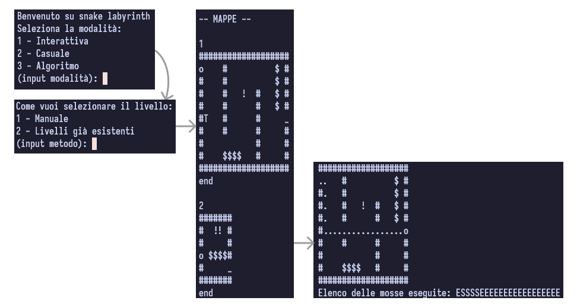

# Snake maze

In this terminal game you can guide Snake to the exit of the maze manually, randomly or by using an algorithm that avoids walls.

Various power-ups/hazards can be found along the maze, such as:
- **#**: wall.
- **$**: gives +10 points and a piece of tail.
- **!**: halves tail and score.
- **T**: allows you to pierce walls 3 times (stacks).
- **_**: the exit.

> Note that for every move you make that does not interact with power-ups or hazards that affect your score points ($, ! and tail) your score will decrease by 1.
Also, if you eat the tail, you will lose 10 points for each piece of tail you ate.

## Example
